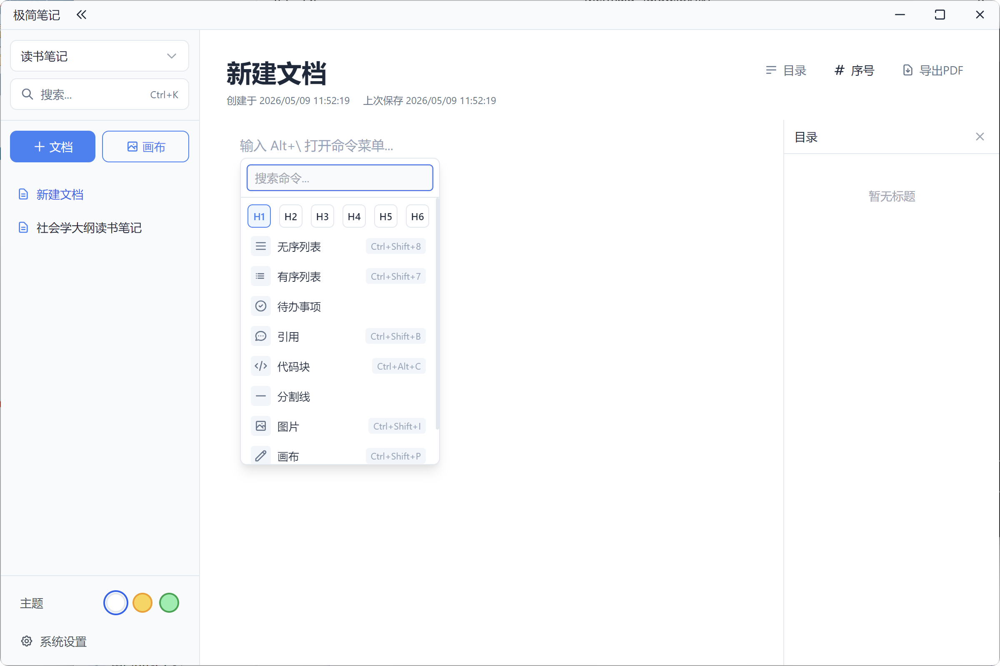

# 极简笔记（LocalKB）

一个面向个人使用的本地笔记应用。



它不试图成为团队协作平台，也不试图成为对外发布内容的排版工具。它更适合一个人安静地记录、整理、延展自己的想法：用文字写下思路，用图承接结构，让笔记重新回到思考本身。

## 设计理念与定位

### 个人笔记，而不是专业文档系统

这个项目的定位很明确：**用于个人的思考记录**。

它适合：

- 日常随手记录
- 主题化知识沉淀
- 草稿整理与思路发散
- 用图文混合的方式梳理想法

它并不以这些目标为优先：

- 专业文档编排
- 团队协作写作
- 对外内容展示
- 严格流程化的知识管理

如果你的目标是写正式文档、沉淀面向团队的规范内容、或者对外呈现排版良好的知识页面，更推荐使用更偏文档场景的工具，例如语雀、飞书文档、Notion、Confluence 等。

### 极简设计

项目希望尽量减少界面和操作对注意力的打扰。

核心表达只有两种：

- **文字**：承载线性思考与细节推演
- **图**：承载结构、关系与发散过程

不追求功能堆叠，也不追求复杂系统感，而是尽量让界面退后，让内容和思考留在前面。

### 克制地使用 AI

AI 在这里不是主角，而是辅助。

它主要用于：

- 对选中文本进行润色
- 对已有内容进行扩写

AI 能力默认需要用户自行配置，且只在明确触发时参与。这个项目更强调“人先思考，AI 后辅助”，而不是让写作过程被 AI 主导。

## 功能特性

### 1. 本地知识库管理

- 支持创建、切换、重命名、删除知识库
- 每个知识库独立管理自己的文档与资源
- 数据保存在本地，适合个人长期积累

### 2. 文档与画布双形态记录

- 支持普通文档编辑
- 支持独立画布创建与编辑
- 适合在文字记录和图形表达之间切换

### 3. 富文本编辑体验

- 基于 TipTap 的结构化编辑器
- 支持标题、列表、任务列表、引用、代码块、表格、链接、分割线等常见内容形式
- 提供快捷命令菜单，可快速插入标题、列表、待办、引用、代码块、图片、画布、思维导图等
- 支持代码块语法高亮
- 支持图片插入与图片尺寸调整
- 支持富文本粘贴与外部内容导入
- 支持标题层级快捷键

### 4. 思维导图能力

- 支持在编辑过程中插入和编辑思维导图
- 适合梳理主题结构、知识分支与发散思考

### 5. 目录与章节序号

- 自动生成文档目录
- 支持显示/隐藏章节序号
- 长文档中更容易进行结构化浏览

### 6. 搜索与快速访问

- 支持知识库内搜索
- 支持快捷键快速打开搜索
- 便于在个人笔记中快速定位内容

### 7. PDF 导出

- 支持将当前文档导出为 PDF
- 便于归档、打印或离线分享

### 8. 主题与快捷键设置

- 内置白色、暖黄、浅绿三种简洁主题
- 支持自定义快捷键
- 支持恢复默认快捷键配置

### 9. AI 辅助写作

- 支持选中文本后进行润色或扩写
- 支持配置 API Key、模型与提示词
- 当前内置 DeepSeek 相关配置

## 技术栈

### 桌面端框架

- Electron 42（内置 Chromium 148、Node.js 24）
- React 18
- TypeScript
- Vite

### 状态与样式

- Zustand
- Tailwind CSS

### 编辑与内容能力

- TipTap
- lowlight（代码高亮）
- Excalidraw（画布能力）
- Mind Elixir（思维导图能力）

### 构建与发布

- electron-builder 26

## 项目结构

```text
src/
├─ main/       # Electron 主进程，负责本地数据与 IPC
├─ preload/    # 预加载脚本，桥接主进程与渲染进程
├─ renderer/   # React 界面与编辑器逻辑
└─ shared/     # 共享类型与 IPC 通道定义
```

## 本地数据说明

应用数据通过 Electron 的 `userData` 目录保存，主要包括：

- 知识库数据
- 文档内容
- 图片资源
- 主题、AI、快捷键等设置

整体设计偏向本地优先，减少对在线服务的依赖。

## 开发启动

### 环境要求

- Node.js 18 及以上（推荐 20 或更新版本）
- npm

**操作系统要求**：
- **Windows**：Windows 10 1903 (2019) 及以上
- **macOS**：macOS 10.15 (Catalina) 及以上
- **Linux**：主流桌面环境（GNOME、KDE 等）

可通过以下命令检查当前 Node.js 版本：

```bash
node --version
```

若版本过低，建议使用版本管理工具切换：

```bash
# 使用 nvm
nvm install 20
nvm use 20

# 或使用 fnm
fnm install 20
fnm use 20
```

项目通过 `package.json` 的 `engines` 字段声明了 Node.js >= 18，低于该版本执行 `npm install` 时会收到警告。

### 安装依赖

```bash
npm install
```

> 项目内置 `.npmrc`，已将 Electron 二进制下载指向国内镜像（npmmirror），国内网络环境无需额外配置即可安装。

### 启动开发环境

```bash
npm run dev
```

这会同时启动：

- Vite 开发服务
- Electron 桌面应用

### 运行测试

```bash
npm test
```

基于 Vitest，覆盖富文本粘贴等核心逻辑。

## 构建与打包

### 构建项目

```bash
npm run build
```

### 打包桌面应用

```bash
npm run electron:build
```

当前配置已包含桌面端打包能力：

- Windows: NSIS 安装包
- macOS: DMG
- Linux: AppImage

## AI 使用说明

AI 功能默认不会自动生效，需要先在应用设置中完成配置：

- API Key
- 模型
- 提示词

目前 AI 更适合作为“改写和辅助整理”工具，而不是替代写作本身。

## 默认快捷键

**命令菜单**：在段落开头输入 `/` 字符可快速唤起命令菜单，插入标题、列表、引用、代码块、图片、画板、思维导图等内容块。

可在「设置 - 快捷键」中查看与自定义，标记为只读的快捷键由编辑器内置，不可修改。

| 功能 | 默认快捷键 | 说明 |
| --- | --- | --- |
| 打开搜索 | `Ctrl+K` | 可修改 |
| 图片命令 | `Ctrl+Shift+I` | 可修改 |
| 画布命令 | `Ctrl+Shift+P` | 可修改 |
| 思维导图 | `Ctrl+Shift+M` | 可修改 |
| 标题 1 - 6 | `Ctrl+Alt+1` 至 `Ctrl+Alt+6` | 只读 |

## 适合什么人

这个项目更适合下面这类使用场景：

- 把笔记当成思考过程，而不是成果展示
- 喜欢本地保存与轻量工具
- 需要同时使用文字、画布、思维导图记录内容
- 希望 AI 只是辅助，而不是接管写作

## License

MIT
