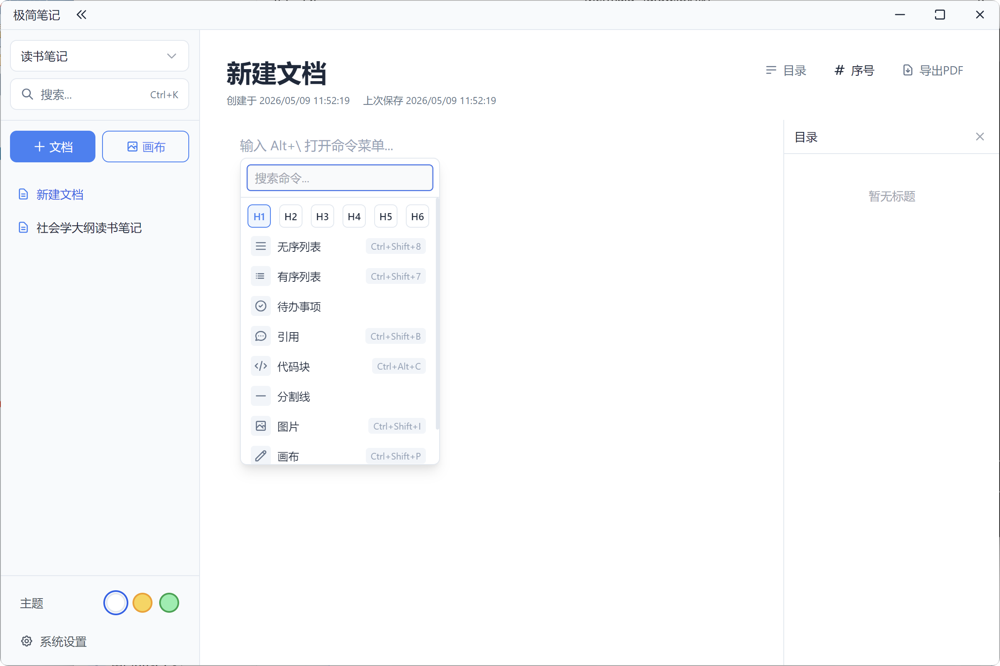

# 极简笔记（Jijian Notes）

极简笔记（英文名 **Jijian Notes**，技术标识 `jijian-notes`）是一个面向个人使用的本地笔记应用。



它不试图成为团队协作平台，也不试图成为对外发布内容的排版工具。它更适合一个人安静地记录、整理、延展自己的想法：用文字写下思路，用图承接结构，让笔记重新回到思考本身。

## 设计理念与定位

### 个人笔记，而不是专业文档系统

这个项目的定位很明确：**用于个人的思考记录**。

它适合：

- 日常随手记录
- 主题化知识沉淀
- 草稿整理与思路发散
- 用图文混合的方式梳理想法

它并不以这些目标为优先：

- 专业文档编排
- 团队协作写作
- 对外内容展示
- 严格流程化的知识管理

如果你的目标是写正式文档、沉淀面向团队的规范内容、或者对外呈现排版良好的知识页面，更推荐使用更偏文档场景的工具，例如语雀、飞书文档、Notion、Confluence 等。

### 极简设计

项目希望尽量减少界面和操作对注意力的打扰。

核心表达只有两种：

- **文字**：承载线性思考与细节推演
- **图**：承载结构、关系与发散过程

不追求功能堆叠，也不追求复杂系统感，而是尽量让界面退后，让内容和思考留在前面。

### 克制地使用 AI

AI 在这里不是主角，而是辅助。

它主要用于：

- 对选中文本进行润色
- 对已有内容进行扩写

AI 能力默认需要用户自行配置，且只在明确触发时参与。这个项目更强调“人先思考，AI 后辅助”，而不是让写作过程被 AI 主导。

## 功能特性

### 1. 本地知识库管理

- 支持创建、切换、重命名、删除知识库
- 每个知识库独立管理自己的文档与资源
- 数据保存在本地，适合个人长期积累

### 2. 文档与画布双形态记录

- 支持普通文档编辑
- 支持独立画布创建与编辑
- 适合在文字记录和图形表达之间切换
- 组只负责组织结构，文档和画布始终是实际内容，不会为组创建空文档
- 组内可继续创建子组、文档或画布，形成任意层级的树状结构
- 支持拖拽组、文档和画布，在根层或不同组之间移动和排序
- 含有文档或画布的组不能删除；请先移动或删除其中的内容。只包含空组的组树可安全删除

### 3. 富文本编辑体验

- 基于 TipTap 的结构化编辑器
- 支持标题、列表、任务列表、引用、代码块、表格、链接、分割线等常见内容形式
- 提供快捷命令菜单，可快速插入标题、列表、待办、引用、代码块、图片、画布、思维导图等
- 支持代码块语法高亮
- 支持图片插入与图片尺寸调整
- 支持富文本粘贴与外部内容导入
- 支持标题层级快捷键

### 4. 思维导图能力

- 支持在编辑过程中插入和编辑思维导图
- 适合梳理主题结构、知识分支与发散思考

### 5. 目录与章节序号

- 自动生成文档目录
- 支持显示/隐藏章节序号
- 长文档中更容易进行结构化浏览

### 6. 搜索与快速访问

- 支持知识库内搜索
- 支持快捷键快速打开搜索
- 搜索结果显示所在组路径；打开结果时会自动展开对应分支并定位文档
- 便于在个人笔记中快速定位内容

### 7. PDF 导出

- 支持将当前文档导出为 PDF
- 便于归档、打印或离线分享

### 8. 主题与快捷键设置

- 内置白色、暖黄、浅绿三种简洁主题
- 支持自定义快捷键
- 支持恢复默认快捷键配置

### 9. AI 辅助写作

- 支持选中文本后进行润色或扩写
- 支持配置 API Key、模型与提示词
- 当前内置 DeepSeek 相关配置

### 10. 本地 MCP 服务

- 可在「设置 - MCP 服务」中启停仅监听 `127.0.0.1` 的 Streamable HTTP 服务
- 支持复制带随机令牌的 Agent 连接地址，连接面向整个应用，不绑定单个知识库
- Agent 与应用页面共享同一个 `KnowledgeService`，不会绕过校验直接读写磁盘
- 工具输入和结构化输出统一使用原生 JSON，不做 Markdown/HTML 转换，也不使用 ETag
- 工具按知识库、文档树、TipTap 文档、Excalidraw 画布、MindElixir 思维导图和附件分域

## 技术栈

### 桌面端框架

- Electron 44（内置 Chromium 152、Node.js 24）
- React 18
- TypeScript
- Vite

### 状态与样式

- Zustand
- Tailwind CSS
- React Arborist（树导航与拖拽）

### 编辑与内容能力

- TipTap
- lowlight（代码高亮）
- Excalidraw（画布能力）
- Mind Elixir（思维导图能力）

### 构建与发布

- electron-builder 26

## 项目结构

```text
src/
├─ main/       # Electron 主进程，负责本地数据与 IPC
├─ preload/    # 预加载脚本，桥接主进程与渲染进程
├─ renderer/   # React 界面与编辑器逻辑
└─ shared/     # 共享类型与 IPC 通道定义
```

## 本地数据说明

应用数据通过 Electron 的 `userData/data` 目录保存。每个知识库采用原生结构：

```text
vaults/<vaultId>/
├─ vault.json
├─ tree.json
├─ canvases/<canvasId>.json
└─ documents/<documentId>/
   ├─ document.json
   ├─ canvases/<canvasId>.json
   ├─ mindmaps/<mindMapId>.json
   └─ assets/<assetId>.<ext>
```

- `tree.json` 只保存顶层组、文档、独立画布的父子关系和排序
- 文档直接保存 TipTap JSON，画布直接保存 Excalidraw scene，思维导图直接保存 MindElixir node tree
- 文档中的画布、思维导图和图片节点只保存稳定资源 ID 与预览属性
- 主题、AI、快捷键和 MCP 配置保存在应用级 `settings.json`

整体设计偏向本地优先，减少对在线服务的依赖。

## 产品名称与兼容标识

- 对外中文名统一使用“极简笔记”，英文名统一使用“Jijian Notes”。
- npm 包、MCP 服务和未来仓库地址使用技术标识 `jijian-notes`。
- `localkb-resource`、`localkb:*` 事件、`localkb-*` 本地存储键及临时目录前缀属于历史兼容命名空间，不是产品名称。为保证已有数据和链接继续可用，这些内部标识不会随品牌名称替换。
- GitHub 仓库后续计划使用 `jijian-notes` 名称；本地检出目录可以继续保留为 `LocalKB/`，不影响应用身份和数据路径。

## 开发启动

### 环境要求

- Node.js 24 LTS 及以上
- npm

**操作系统要求**：
- **Windows**：Windows 10 1903 (2019) 及以上，64 位
- **macOS**：macOS 13 (Ventura) 及以上
- **Linux**：主流 64 位桌面环境（GNOME、KDE 等）

可通过以下命令检查当前 Node.js 版本：

```bash
node --version
```

若版本过低，建议使用版本管理工具切换：

```bash
# 使用 nvm
nvm install 24
nvm use 24

# 或使用 fnm
fnm install 24
fnm use 24
```

项目通过 `package.json` 的 `engines` 字段声明了 Node.js >= 24，低于该版本执行 `npm install` 时会收到警告。

### 安装依赖

```bash
npm install
```

> 项目内置 `.npmrc`，已将 Electron 二进制下载指向国内镜像（npmmirror），国内网络环境无需额外配置即可安装。

### 启动开发环境

```bash
npm run dev
```

这会同时启动：

- Vite 开发服务
- Electron 桌面应用

### 运行测试

```bash
npm test
```

基于 Vitest，覆盖富文本粘贴等核心逻辑。

## 构建与打包

### 构建项目

```bash
npm run build
```

### 打包桌面应用

```bash
npm run electron:build
```

当前配置已包含桌面端打包能力：

- Windows: NSIS 安装包
- macOS: DMG
- Linux: AppImage

## AI 使用说明

AI 功能默认不会自动生效，需要先在应用设置中完成配置：

- API Key
- 模型
- 提示词

目前 AI 更适合作为“改写和辅助整理”工具，而不是替代写作本身。

## MCP 使用说明

1. 打开「设置 - MCP 服务」。
2. 选择端口并启用服务，保存设置。
3. 服务显示“运行中”后，点击「复制 Agent 连接地址」。
4. 将完整 URL 交给支持 Streamable HTTP MCP 的本机 Agent。

连接 URL 中的 token 属于敏感凭据。服务固定监听 loopback，但仍应只把链接交给可信的本机 Agent；怀疑泄露时可在设置中重置令牌。

工具清单：

| 领域 | 工具 |
| --- | --- |
| 知识库 | `vault_list`、`vault_create`、`vault_update`、`vault_delete` |
| 文档树 | `tree_get`、`tree_insert`、`tree_update`、`tree_delete` |
| 文档 | `document_get`、`document_search`、`document_insert`、`document_update`、`document_delete` |
| 画布 | `canvas_create`、`canvas_get`、`canvas_search`、`canvas_insert`、`canvas_update`、`canvas_delete`、`canvas_remove` |
| 思维导图 | `mindmap_create`、`mindmap_get`、`mindmap_search`、`mindmap_insert`、`mindmap_update`、`mindmap_move`、`mindmap_delete`、`mindmap_remove` |
| 附件 | `asset_import`、`asset_get`、`asset_remove` |

所有资源调用都显式携带 `vaultId`。例如文档节点更新直接提交 TipTap 原生结构：

```json
{
  "vaultId": "<vaultId>",
  "documentId": "<documentId>",
  "updates": [
    {
      "nodeId": "<stableNodeId>",
      "content": [{ "type": "text", "text": "更新后的内容" }]
    }
  ]
}
```

省略的 `type` 和 `attrs` 会保留。嵌入画布、思维导图和附件使用显式两步流程：先创建资源，再通过 `document_insert` 插入引用节点；删除时先删除引用节点，再删除资源。

## 默认快捷键

**命令菜单**：在段落开头输入 `/` 字符可快速唤起命令菜单，插入标题、列表、引用、代码块、图片、画板、思维导图等内容块。

可在「设置 - 快捷键」中查看与自定义，标记为只读的快捷键由编辑器内置，不可修改。

| 功能 | 默认快捷键 | 说明 |
| --- | --- | --- |
| 打开搜索 | `Ctrl+K` | 可修改 |
| 图片命令 | `Ctrl+Shift+I` | 可修改 |
| 画布命令 | `Ctrl+Shift+P` | 可修改 |
| 思维导图 | `Ctrl+Shift+M` | 可修改 |
| 标题 1 - 6 | `Ctrl+Alt+1` 至 `Ctrl+Alt+6` | 只读 |

## 适合什么人

这个项目更适合下面这类使用场景：

- 把笔记当成思考过程，而不是成果展示
- 喜欢本地保存与轻量工具
- 需要同时使用文字、画布、思维导图记录内容
- 希望 AI 只是辅助，而不是接管写作

## License

MIT
